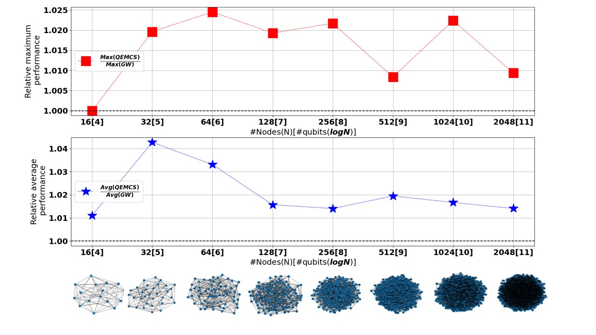

# Quantum Entangled MaxCut Solver (QEMC)

A quantum computing implementation for solving the Maximum Cut (MaxCut) problem using PennyLane and Qiskit, with support for both quantum simulators and real quantum hardware (IBM Quantum).

## Paper Reference

This code implements the algorithms described in:

**"A quantum entanglement-based approach for computing Maximum Cut in graphs"**  
arXiv:2308.10383  
Link: https://arxiv.org/abs/2308.10383

## Overview

This project implements a quantum algorithm for solving the MaxCut problem, which is a fundamental NP-hard optimization problem in graph theory. The implementation uses variational quantum algorithms with entangled quantum circuits to find approximate solutions.

### Key Features

- Quantum circuit implementation using PennyLane
- Support for both noiseless simulation and real quantum hardware (IBM Quantum)
- Database integration for experiment tracking and result storage
- Comparison with classical Goemans-Williamson algorithm
- Scalable to graphs with up to 8192+ nodes
- Comprehensive visualization and analysis tools
- Support for regular graphs with different degrees

## Project Structure

```
├── Database Management
│   ├── dbAdapter.py                     # Database interface for experiment tracking
│   └── DbAdapterGraph.py                # Graph-specific database operations
│
├── Quantum Algorithms
│   ├── with_ent_general_db.py           # Main quantum algorithm with entanglement
│   ├── with_ent_general_db_simulation.py # Simulation version with shot noise
│   ├── with_ent_general_db_test.py      # Test version for debugging
│   ├── with_ent_circular.py             # Circular graph specialization
│   ├── no_ent_general.py                # Non-entangled version
│   └── no_ent_circular.py               # Non-entangled circular graphs
│
├── Classical Algorithms
│   ├── Goemans-Williamson.py            # Classical GW algorithm implementation
│   ├── Adi_GW.py                        # Alternative GW implementation
│   └── max_cut_exhaustive_search.py     # Exhaustive search for small graphs
│
├── Visualization & Analysis
│   ├── DrawGraphFromDb.py               # Database result visualization
│   ├── plot_individual_runs.py          # Plot individual experiment runs
│   ├── plot_averaged_by_blacks.py       # Plot averaged results grouped by black nodes
│   ├── plot_convergence_analysis.py     # Analyze convergence patterns
│   ├── show_graph.py                    # Graph structure visualization
│   └── show_as_archs.py                 # Export graph edges as CSV
│
├── Experiment Runners
│   ├── HWRuns.py                        # Hardware experiment orchestration
│   ├── ShotsSymRuns.py                  # Shot noise analysis
│   ├── completeRuns.py                  # Complete experiment suite runner
│   ├── runner.py                        # Basic runner script
│   ├── runner_general*.py               # Various specialized runners
│   ├── runner_GW.py                     # Goemans-Williamson runner
│   ├── runner_es.py                     # Exhaustive search runner
│   └── runner_show_graph.py             # Graph visualization runner
│
├── Utilities
│   ├── create_graph.py                  # Graph generation utilities
│   ├── create_graph_regular.py          # Regular graph generation
│   ├── convert_to_g6.py                 # Graph format conversion
│   ├── organize_experiments_by_params.py # Organize results by parameters
│   └── simple_base_version.py           # Simplified baseline version
│
├── Data & Results
│   ├── data/                            # Processed data and pickled results
│   ├── figurs/                          # Generated figures and plots
│   ├── results/                         # Organized experiment results
│   ├── google_graphs/                   # Test graphs from Google
│   ├── regular_graphs/                  # Regular graph instances
│   ├── regular_graph_GW*/               # GW results for regular graphs
│   └── graph_draw/                      # Graph visualizations
│
└── Documentation
    ├── README.md                        # This file
    ├── requirements.txt                 # Python dependencies
    └── archs.txt                        # Architecture notes
```

## Requirements

### Python Dependencies

Install all dependencies using:
```bash
pip install -r requirements.txt
```

Or manually install:
```bash
pip install pennylane
pip install qiskit
pip install qiskit-ibmq-provider
pip install networkx
pip install numpy
pip install matplotlib
pip install cvxpy
pip install mariadb
pip install pandas
pip install tqdm
pip install numba
pip install natsort
```

### Database Setup

The project uses MariaDB for experiment tracking. Set up a database named `maxcut` with the following tables:

- `experiments` - Main experiment metadata
- `iterations` - Per-iteration results
- `loss` - Loss function values
- `maxcut` - MaxCut values found
- `maxcut_max` - Maximum maxcut values
- `maxcut_max_1000` - Maximum maxcut values for 1000 iterations
- `groups` - Node groupings
- `probs` - Probability distributions
- `blacks` - Black node counts

Database connection configuration (in dbAdapter.py):
```python
user="root"
password="root"
host="localhost"
port=3306
database="maxcut"
```

## Graph Data

### Pre-generated Graphs

The project includes several sets of pre-generated graphs:

- **Regular graphs**: Located in `regular_graphs/` with degree 3 and 9
  - Sizes: 8, 16, 32, 64, 128, 256, 512, 1024, 2048, 4096, 8192 nodes
  - Format: `vertices_regular_[degree]_size_[nodes].g6`

- **Google test graphs**: Located in `google_graphs/` 
  - Small regular-3 graphs for testing (4-32 nodes)
  - Include pre-computed GW solutions and optimal cuts

### Graph Generation

Create regular graphs:
```bash
python create_graph_regular.py
```

Create random graphs:
```bash
python create_graph.py <count> <size>
# Example: python create_graph.py 10 5  # Creates 10 graphs with 2^5 = 32 nodes
```

Convert edge lists to g6 format:
```bash
python convert_to_g6.py
```

## Usage

### 1. Run Quantum Experiments

#### Simulator Experiments
```bash
python with_ent_general_db.py <expected_blacks> <graph_file> <layers> <stepsize> <steps> <shots> <backend> <comment> <expected_maxcut>
```

Example:
```bash
python with_ent_general_db.py 8 graphs/vertices_16.g6 2 0.7 350 768 sym "test_run" 21
```

Parameters:
- `expected_blacks`: Target number of nodes in one partition (usually n/2 for n nodes)
- `graph_file`: Path to graph file in g6 format
- `layers`: Number of entangling layers in the quantum circuit
- `stepsize`: Learning rate for the optimizer
- `steps`: Number of optimization iterations
- `shots`: Number of measurement shots (use -1 for exact simulation)
- `backend`: Either 'sym' for simulator or IBM backend name (e.g., 'ibmq_jakarta')
- `comment`: Description for the experiment
- `expected_maxcut`: Known optimal maxcut value (for early stopping)

#### Hardware Experiments (IBM Quantum)
```bash
python HWRuns.py
```

This script automatically selects appropriate parameters based on graph size and runs on real quantum hardware.

### 2. Classical Comparison

Run Goemans-Williamson algorithm:
```bash
python Goemans-Williamson.py <graph_file> <num_trials>
```

Run exhaustive search (small graphs only):
```bash
python max_cut_exhaustive_search.py <graph_file>
```

### 3. Batch Experiments

Run complete experiment suite:
```bash
python completeRuns.py
```

Run GW on all graphs:
```bash
python runner_GW.py
```

### 4. Analyze Results

Generate visualizations from database:
```bash
python DrawGraphFromDb.py
```

Plot individual experiment runs:
```bash
python plot_individual_runs.py
```

Plot averaged results by black node count:
```bash
python plot_averaged_by_blacks.py
```

Analyze convergence patterns:
```bash
python plot_convergence_analysis.py
```

Visualize graph structure:
```bash
python show_graph.py <graph_file>
```

## IBM Quantum Access

To use IBM Quantum hardware:

1. Get an IBM Quantum account at https://quantum-computing.ibm.com/
2. Get your API token from your IBM Quantum dashboard
3. Replace the token in the code with your credentials:

```python
provider = IBMQ.enable_account(
    "YOUR_TOKEN_HERE",
    hub='YOUR_HUB', 
    group='YOUR_GROUP', 
    project='YOUR_PROJECT'
)
```

Available backends include:
- `ibmq_jakarta`
- `ibmq_manila`
- `ibmq_quito`
- And other IBM Quantum systems

## Experiment Metadata

The following optimized parameters are used for different graph sizes:

| Nodes | Stepsize | Layers | Iterations | Shots | Mean GW | Max GW | Optimal Cut |
|-------|----------|--------|------------|-------|---------|--------|-------------|
| 4     | 0.9      | 1      | 10         | 48    | 3.7     | 4      | 4           |
| 6     | 0.9      | 2      | 80         | 108   | 7       | 7      | 7           |
| 8     | 0.9      | 2      | 250        | 192   | 10      | 10     | 10          |
| 10    | 0.95     | 2      | 100        | 300   | 11      | 12     | 12          |
| 12    | 0.98     | 3      | 300        | 432   | 15.1    | 16     | 16          |
| 14    | 0.99     | 3      | 325        | 588   | 18.6    | 19     | 19          |
| 16    | 0.95     | 5      | 350        | 768   | 20.3    | 21     | 21          |
| 32    | 0.7      | 5      | 1000       | 768   | 98.3    | 102    | 42          |
| 64    | 0.1      | 50     | 200        | -     | 199.5   | 204    | -           |
| 128   | 0.2      | 40     | 200        | -     | 407.4   | 415    | -           |
| 256   | 0.08     | 80     | 200        | -     | 817.0   | 830    | -           |
| 512   | 0.1      | 70     | 1000       | -     | 1633.8  | 1672   | -           |
| 1024  | 0.12     | 100    | 1000       | -     | 3285.8  | 3307   | -           |
| 2048  | 0.08     | 120    | 1000       | -     | 6580.3  | 6630   | -           |

## Results Analysis

The project includes comprehensive result analysis tools:

1. **Performance Metrics**:
   - MaxCut value progression
   - Loss function convergence
   - Comparison with GW bounds
   - Hardware vs simulation comparison

2. **Visualization Outputs**:
   - Heatmaps showing optimal parameters (in `figurs/`)
   - Convergence plots for different configurations
   - Hardware performance comparisons
   - Parameter sensitivity analysis

3. **Key Findings**:
   - Near-optimal solutions for graphs up to 32 nodes
   - Competitive performance vs Goemans-Williamson
   - Successful hardware validation on IBM Quantum devices
   - Scalability demonstrations up to 8192 nodes

### Performance Comparison



The figure above shows the relative performance of QEMC compared to the Goemans-Williamson algorithm across different graph sizes:
- **Top plot**: Maximum cut performance ratio (Max(QEMC)/Max(GW))
- **Bottom plot**: Average performance ratio (Avg(QEMC)/Avg(GW))
- Results demonstrate that QEMC achieves near-optimal performance (ratio ≈ 1.0) across all tested graph sizes from 16 to 2048 nodes

## Citation

If you use this code in your research, please cite:

```bibtex
@article{qemc2023,
  title={A quantum entanglement-based approach for computing Maximum Cut in graphs},
  author={[Authors]},
  journal={arXiv preprint arXiv:2308.10383},
  year={2023}
}
```

## License

This project is licensed under the Apache License 2.0 - see the LICENSE file for details.

## Acknowledgments

- IBM Quantum Network for hardware access
- PennyLane team for quantum computing framework
- NetworkX for graph processing capabilities
- The authors of the Goemans-Williamson algorithm

## Troubleshooting

1. **Database Connection Issues**: Ensure MariaDB is running and credentials are correct
2. **IBM Quantum Access**: Verify your account has access to the required backends
3. **Memory Issues**: Large graphs (>4096 nodes) may require significant RAM
4. **Convergence Problems**: Try adjusting stepsize and number of layers based on the metadata table